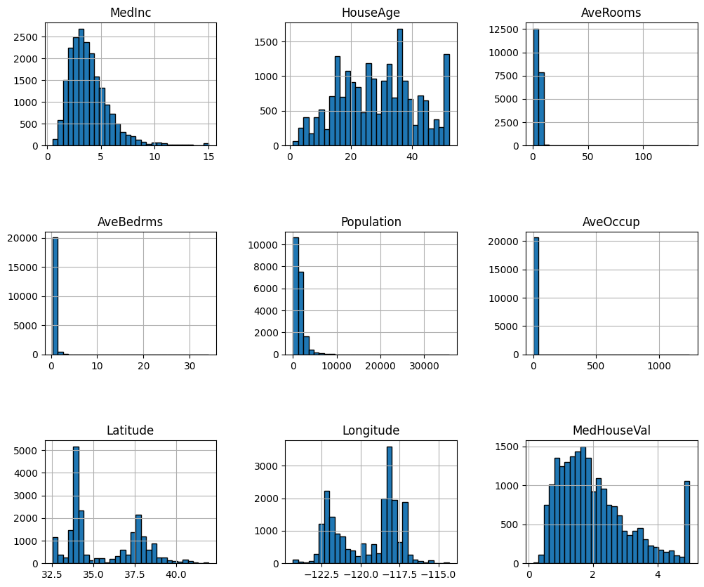
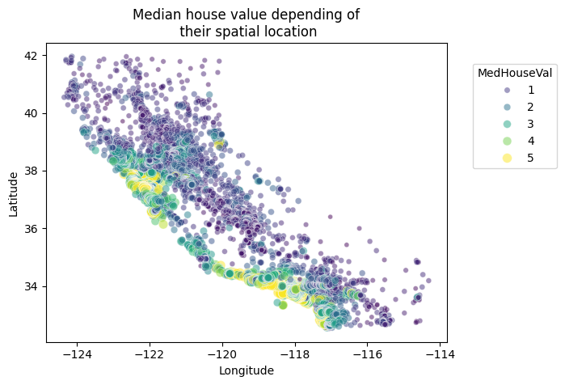

# 🏠 California Housing Price Prediction with Neural Networks


A machine learning project that predicts median house values in California using a neural network implemented with TensorFlow/Keras.


## 🧠 Model Architecture
```python
Sequential([
    Dense(50, activation='relu', input_shape=(8,)),  # Input layer
    Dense(10, activation='relu'),                   # Hidden layer
    Dense(1)                                        # Output layer
])
```

Compiled with:
- Optimizer: Adam
- Loss: Mean Squared Error (MSE)
- Metric: Mean Absolute Error (MAE)

--- 
## 📊 Sample Visualizations

### Feature Distributions


### Geographical Price Patterns


## 📊 Data Pipeline
1. **Loading**: Fetches dataset from scikit-learn
2. **Visualization**:
   - Feature distributions
   - Geographical price distribution
3. **Preprocessing**:
   - Train/validation/test split (60/20/20)
   - StandardScaler normalization
  
## 📂 Project Structure

```bash
.
├── data_loading.py          # Data ingestion and inspection
├── data_visualization.py    # Exploratory data analysis (EDA)
├── data_preprocessing.py    # Data splitting and normalization
├── model.py                 # Neural network architecture
├── train_evaluate.py        # Model training and evaluation
└── README.md                # Project documentation
```

## 🚀 Quick Start

### Prerequisites
```bash
pip install tensorflow scikit-learn pandas matplotlib seaborn
```

### Running the Project
1. **Explore the data**:
```bash
python data_visualization.py
```

2. **Train and evaluate the model**:
```bash
python train_evaluate.py
```

